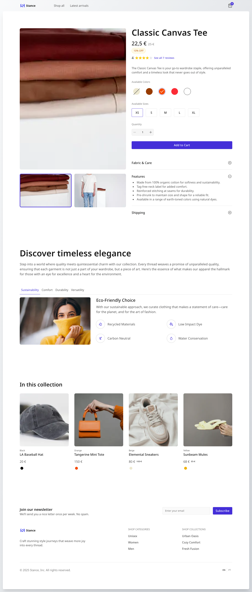
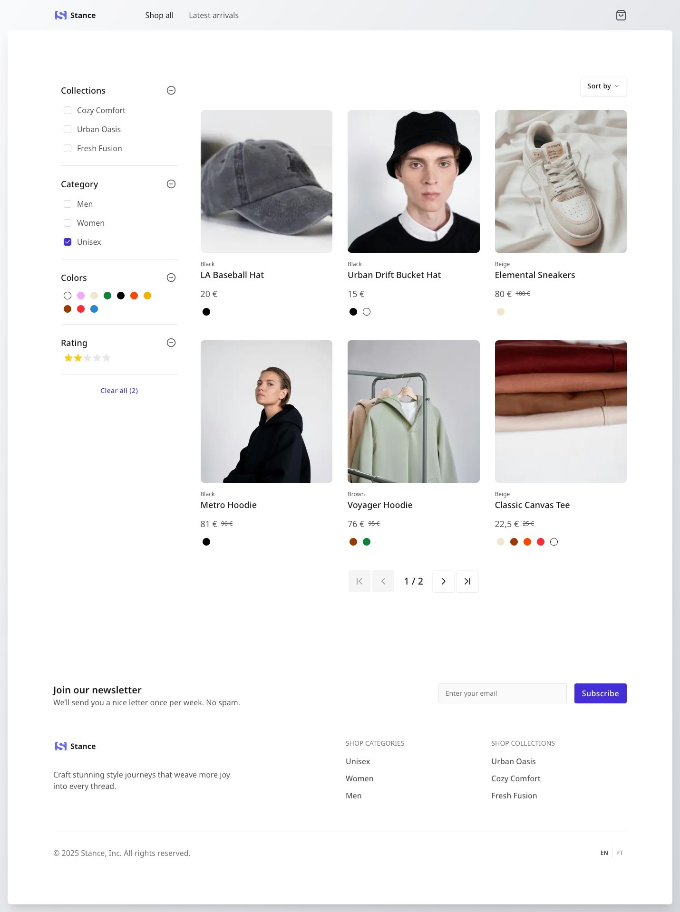
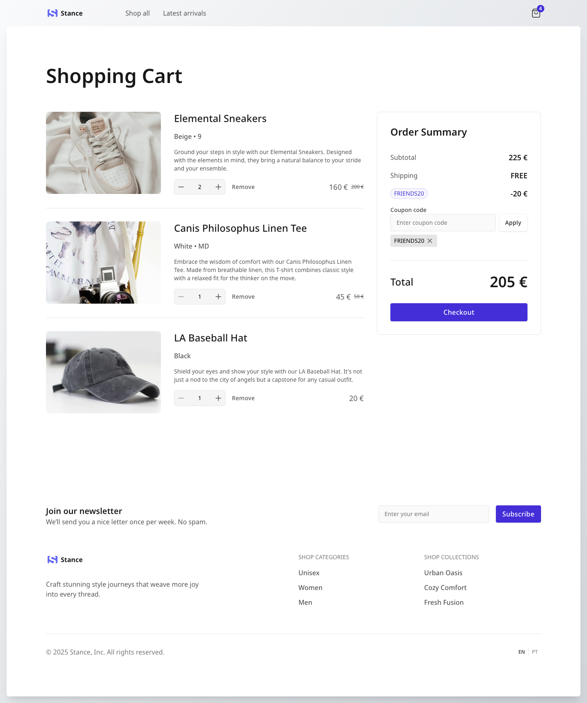

# StyleNest

> **Note:** This project is a work in progress.

StyleNest is a modern, scalable e-commerce web application built with Next.js, TypeScript, and Tailwind CSS. It demonstrates best practices in web development, including internationalization, state management, reusable UI components, and comprehensive testing.

---

## 🚀 Purpose

StyleNest aims to provide a robust foundation for an e-commerce platform, focusing on maintainability, performance, and developer experience.

---

## 🌐 Live Demo

Check out the production site here: [https://stance-liard.vercel.app](https://stance-liard.vercel.app/en)

---

## 🖼️ Screenshots







## 🛠️ Tech Stack

- **Framework:** [Next.js](https://nextjs.org/) (App Router)
- **Language:** TypeScript
- **UI:** React, Tailwind CSS
- **State Management:** Redux Toolkit, redux-persist
- **Internationalization:** next-intl
- **Testing:** Vitest, @testing-library/react, Cypress (E2E)
- **Component Development:** Storybook
- **Linting & Formatting:** ESLint, Prettier
- **CI/CD:** GitHub Actions

---

## 📄 Pages Implemented So Far

- **Home Page:** Product listings, featured sections
- **Product Catalogue Page:** Browse products, filter and sort
- **Product Details Page:** Product info, reviews, add to cart
- **Cart Page:** Cart management, checkout preview
- **404 Not Found Page**
- **(More pages coming soon...)**

---

## 📁 Project Structure

```
.github/workflows/    # GitHub Actions CI/CD workflows
.husky                # Husky configuration
.storybook            # Storybook configuration
__tests__             # Unit and integration test
cypress/              # End-to-end tests (Cypress)
messages              # Internationalization messages
public/               # Static assets
src/
  app/                # Next.js app directory (routing, layouts)
  components/         # Shared and common UI components
  features/           # Feature-based modules (e.g., product, cart)
  hooks/              # Custom React hooks
  i18n/               # Internationalization setup and configs
  lib/                # Utilities, providers, and shared logic
  stories/            # Storybook stories for UI components
```

---

## ✨ Features

- **Internationalization (i18n):** Multi-language support using next-intl.
- **State Management:** Global state with Redux Toolkit and persisted cart state.
- **Reusable UI Components:** Modular, accessible, and tested components.
- **Performance:** SSR, SSG, and skeleton loaders for fast, SEO-friendly pages.
- **SEO Optimization:** Dynamic metadata and structured data (`application/ld+json`) on product pages for improved search engine visibility and rich results.
- **Testing:** Unit and integration tests with Jest and Testing Library.
- **E2E Testing:** Automated end-to-end tests with Cypress for critical user flows.
- **Continuous Integration:** GitHub Actions for automated linting, testing, and build checks on every push and pull request.
- **Developer Experience:** Storybook for UI development, strict linting, and type safety.
- **Scalable Architecture:** Feature-based folder structure for easy extensibility.

---

## ⚙️ GitHub Actions

This project uses GitHub Actions for continuous integration and delivery. The workflows include:

- **Linting:** Runs ESLint and Prettier checks.
- **Unit & Integration Tests:** Executes Jest and Testing Library tests.
- **E2E Tests:** Runs Cypress end-to-end tests.
- **Build:** Ensures the project builds successfully before merging.

All workflows are defined in [`.github/workflows/`](.github/workflows/).

---

## 🤝 Contributing

Contributions are welcome! Please open issues or submit pull requests for improvements and new features.

---

## 📄 License

This project is licensed under the MIT License.
